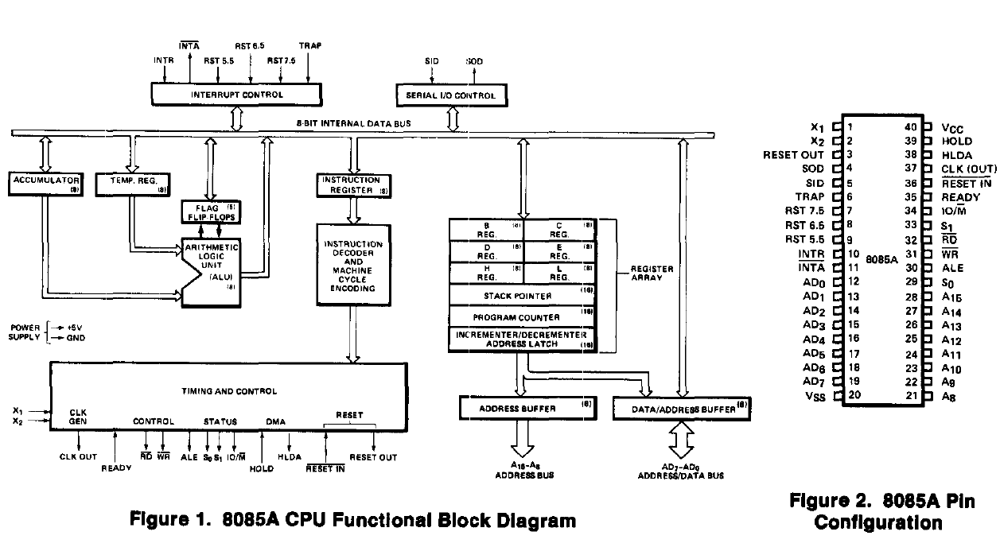

# 8085A/8085A-2 SINGLE CHIP 8-BIT N-CHANNEL MICROPROCESSORS

 * Single +5V Power Supply
 * 100% Software Compatible with 8080A
 * 1.3 µS Instruciont Cycle (8085A); 0.8 µS (8085A-2)
 * On-Chip Clock Generator (With External Crystal, LC or RC Network)
 * On-Chip System Controller; Advanced Cycle Status Information Available for Large System Control
 * Four Vectored Interrupt Inputs (one is Non-Maskable) Plus an 8080A-Compatible Interrupt
 * Serial In/Serial Out Port
 * Decimal, Binary and Double Precision Arithmetic
 * Direct Addressing Capability to 64K Bytes of Memory

The Intel® 8085A is a complete 8 bit parallel Central Processing Unit (CPU).
Its instruction set is 100% software compatible with the 8080A microprocessor, and it is designed to improve the present 8080A's performance by higher system speed.
Its high level of system integration allows a minimum system of three IC's (8085A (CPU), 8156 (RAM/IO) and 8355/8755A (ROM/PROM/IO) while maintaining total system expandability.
The 8085A-2 is a faster version of the 8085A.

The 8085A incorporates all of the features that the 8224 (clock generator) and 8228 (System controller) provede for the 8080A, Thereby offering a high level of system integration.

The 8085A uses a multiplexed data bus. The address is split between the 8 bit address bus and the 8 bit data bus. The on-chip address latches of 8155/8156/8355/8755A memory products allow a direct interface with the 8085A.

Figure 1.

